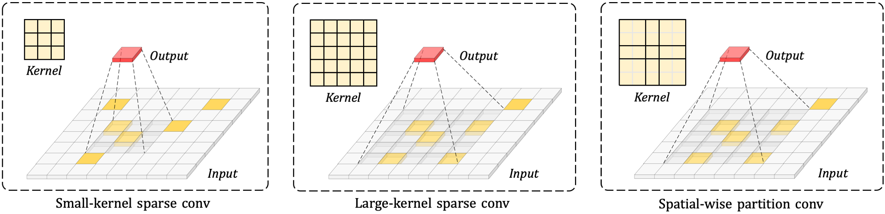
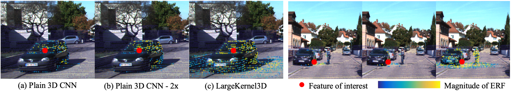

# LargeKernel3D: Scaling up Kernels in 3D Sparse CNNs (CVPR 2023)

This is the implementation of ***LargeKernel3D*** (CVPR 2023). Large kernels are important but expensive in 3D CNNs. We propose spatial-wise partition to conv enable 3D large kernels. High performance on 3D semantic segmentation & object detection. 
For more details, please refer to:

**LargeKernel3D: Scaling up Kernels in 3D Sparse CNNs [[Paper](https://arxiv.org/abs/2206.10555)]** <br />
[Yukang Chen](https://scholar.google.com/citations?user=6p0ygKUAAAAJ&hl=en), [Jianhui Liu](https://scholar.google.com/citations?user=n1JW-jYAAAAJ&hl=en), [Xiangyu Zhang](https://scholar.google.com/citations?user=yuB-cfoAAAAJ&hl=zh-CN), [Xiaojuan Qi](https://scholar.google.com/citations?user=bGn0uacAAAAJ&hl=en), [Jiaya Jia](https://scholar.google.com/citations?user=XPAkzTEAAAAJ&hl=en)<br />

<p align="center">  </p>


### Experimental results

| nuScenes Object Detection                                                                                                    |      Set       | mAP  | NDS  |            Download            |
|------------------------------------------------------------------------------------------------------------------------------|:--------------:|:----:|:----:|:------------------------------:|
| [LargeKernel3D](object-detection/configs/nusc/voxelnet/nusc_centerpoint_voxelnet_0075voxel_fix_bn_z_largekernel3d_tiny.py)   |      val       | 63.3 | 69.1 |        [Pre-trained](https://drive.google.com/file/d/1qDCareDEyzElFMH0iPuMYkMVozI8qSGQ/view?usp=share_link)         |
| [LargeKernel3D](object-detection/configs/nusc/voxelnet/nusc_centerpoint_voxelnet_0075voxel_fix_bn_z_largekernel3d_multimodal.py) |      test      | 65.4 | 70.6 | [Pre-trained](https://drive.google.com/file/d/1Cipmcq5PFyxObWkJPG9LPUNVnYsrlYBH/view?usp=share_link) [Submission](https://drive.google.com/file/d/1y2Km6rCb7PFBoe458cYL-H4Jh3yDeBe1/view?usp=share_link) |
| +test aug  |      test      | 68.7 | 72.8 |         [Submission](https://drive.google.com/file/d/15gYXgwE6XSIJhrnEFFvwKHXdPv9rK_PM/view?usp=share_link)         |
| [LargeKernel3D-F](object-detection/configs/nusc/voxelnet/nusc_centerpoint_voxelnet_0075voxel_fix_bn_z_largekernel3d_multimodal.py) | test |  -   |  -   | [Pre-trained](https://drive.google.com/file/d/1MDSOGEtV0BZ_GCWDiedyLe9h1pi-lnnV/view?usp=share_link) |
| +test aug  |      test      | 71.1 | 74.2 |         [Submission](https://drive.google.com/file/d/1eQkQRA7YPAn6DuEh6oUA_VOv6vvs1csF/view?usp=share_link)         |


| ScanNetv2 Semantic Segmentation |  Set | mIoU |                                               Download                                                |
|-------------------------------------------------------------------------------------|:----:|:----:|:-----------------------------------------------------------------------------------------------------:|
| LargeKernel3D  | val | 73.5 |                                             [Pre-trained]                                             |
| LargeKernel3D  | test | 73.9 | [[Submission]](https://drive.google.com/file/d/18Xm9ZQukxXwR5qQDazICHD7Zhg48CpCw/view?usp=share_link) |

<p align="center">  </p>

## Citation 
If you find this project useful in your research, please consider citing:

```
@inproceedings{chen2023largekernel3d,
  title={LargeKernel3D: Scaling up Kernels in 3D Sparse CNNs},
  author={Yukang Chen and Jianhui Liu and Xiangyu Zhang and Xiaojuan Qi and Jiaya Jia},
  booktitle={Proceedings of the IEEE/CVF Conference on Computer Vision and Pattern Recognition},
  year={2023}
}

```
## Acknowledgement
-  This work is built upon the [FocalsConv](https://github.com/dvlab-research/FocalsConv) for object detection and [Stratified-Transformer](https://github.com/dvlab-research/Stratified-Transformer) for semantic segmentation.

## Our Works in LiDAR-based 3D Computer Vision
- **VoxelNeXt (CVPR 2023)** [[Paper]](https://arxiv.org/abs/2303.11301) [[Code]](https://github.com/dvlab-research/VoxelNeXt) Fully Sparse VoxelNet for 3D Object Detection and Tracking.
- **Focal Sparse Conv (CVPR 2022 Oral)** [[Paper]](https://arxiv.org/abs/2204.12463) [[Code]](https://github.com/dvlab-research/FocalsConv) Dynamic sparse convolution for high performance.
- **Spatial Pruned Conv (NeurIPS 2022)** [[Paper]](https://arxiv.org/abs/2209.14201) [[Code]](https://github.com/CVMI-Lab/SPS-Conv) 50% FLOPs saving for efficient 3D object detection.
- **LargeKernel3D (CVPR 2023)** [[Paper]](https://arxiv.org/abs/2206.10555) [[Code]](https://github.com/dvlab-research/LargeKernel3D) Large-kernel 3D sparse CNN backbone.
- **SphereFormer (CVPR 2023)** [[Paper]](https://arxiv.org/abs/2303.12766) [[Code]](https://github.com/dvlab-research/SphereFormer) Spherical window 3D transformer backbone.
- [spconv-plus](https://github.com/dvlab-research/spconv-plus) A library where we combine our works into [spconv](https://github.com/traveller59/spconv).
- [SparseTransformer](https://github.com/dvlab-research/SparseTransformer) A library that includes high-efficiency transformer implementations for sparse point cloud or voxel data.


## License

This project is released under the [Apache 2.0 license](LICENSE).
