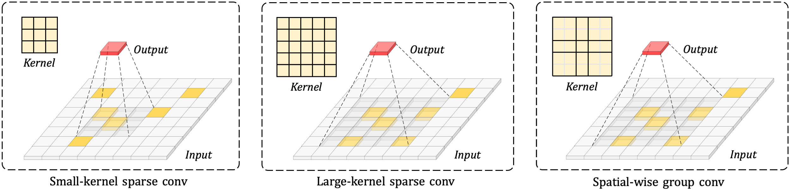

[]()


# Scaling up Kernels in 3D CNNs

This is the official implementation of LargKernel3D, high-performance 3D convolutional backbone networks for 3D tasks, object detection and semantic segmentation. For more details, please refer to:

**Scaling up Kernels in 3D CNNs [[Paper]()]** <br />
Yukang Chen, Jianhui Liu, Xiaojuan Qi, Xiangyu Zhang, Jian Sun, Jiaya Jia<br />

<p align="center">  </p>

## Code is comming soon.

## Citation 
If you find this project useful in your research, please consider citing:

```
@article{largekernel3d-chen,
  author    = {Chen, Yukang and Liu, Jianhui and Qi, Xiaojuan and Zhang, Xiangyu and Sun, Jian and Jia, Jiaya},
  title     = {Scaling up Kernels in 3D CNNs},
  journal   = {arxiv},
  year      = {2022},
}
```


## Related Repos
1. [FocalsConv](https://github.com/dvlab-research/FocalsConv) 
2. [OpenPCDet](https://github.com/open-mmlab/OpenPCDet) 
3. [CenterPoint](https://github.com/tianweiy/CenterPoint) 
4. [spconv](https://github.com/traveller59/spconv) 
5. [MinkowskiNet](https://github.com/chrischoy/SpatioTemporalSegmentation) 
6. [MinkowskiEngine](https://github.com/NVIDIA/MinkowskiEngine) 
